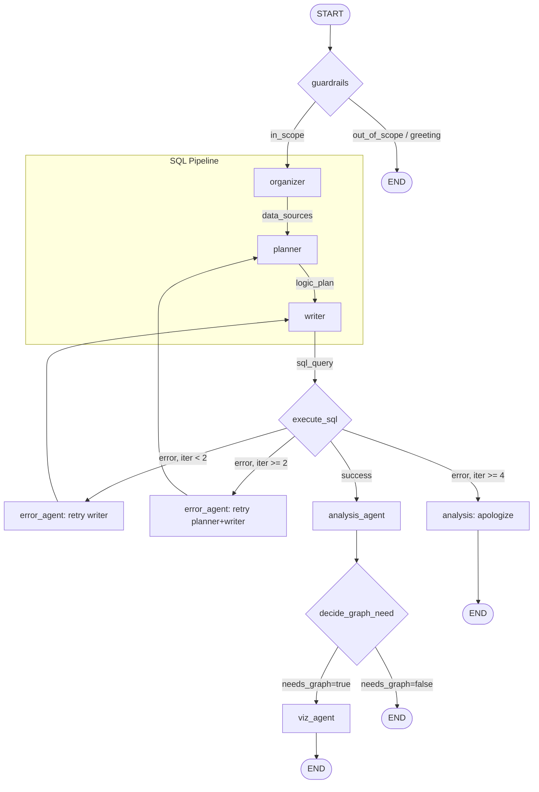

# DBAgent

Multi-agent Text-to-SQL chatbot with evaluation framework.

Convert natural language questions into SQL queries, execute them safely, and get answers with optional visualizations. Supports interactive chat and batch evaluation on Text-to-SQL datasets.

## Architecture

The same agent graph handles both interactive chat and batch evaluation. Evaluation injects dataset turns as user messages, running through identical infrastructure.

### Agent Flow



### Agent Nodes

| # | Node | Purpose |
|---|------|---------|
| 1 | **guardrails** | Scope check, handle greetings |
| 2 | **organizer** | Identify tables, fields, joins from schema |
| 3 | **planner** | Plain English SQL execution plan |
| 4 | **writer** | Generate efficient SQL |
| 5 | **execute** | Run via `safe_query` with timeout |
| 6 | **error_agent** | Fix SQL errors, escalate if needed |
| 7 | **analysis** | Convert results to natural language |
| 8 | **decide_graph** | Determine if visualization helps |
| 9 | **viz_agent** | Generate safe Plotly visualization |

### Error Recovery

```
Attempt 1-2:  Retry writer only (syntax fixes)
Attempt 3:   Escalate to planner → writer (logic fixes)
Attempt 4+:  Give up, apologize
```

## UI Layout

```
┌─────────────────────────────────────────────────────────────────┐
│  [Chat]  [History]  [Evaluation]              [DB: dropdown ▼]  │
├─────────────────────────────────────────────────────────────────┤
│                                                                 │
│  Chat:        Interactive Q&A with any database                 │
│  History:     Browse past conversations (by DB)                 │
│  Evaluation:  View dataset evaluation results                   │
│                                                                 │
└─────────────────────────────────────────────────────────────────┘
```

- **Chat**: Interactive with collapsible debug steps, visualizations
- **History**: Read-only, grouped by database
- **Evaluation**: Read-only, filter by dataset/match status

## Project Structure

```
DBAgent/
├── README.md               # This file
├── main.py                 # Entry point
├── .env                    # OPENAI_API_KEY
│
├── agent/                  # LangGraph agent
│   ├── README.md
│   ├── graph.py            # StateGraph definition
│   ├── state.py            # AgentState TypedDict
│   ├── nodes/              # Individual agent nodes
│   ├── tools/              # db_tools, safe_viz
│   └── schemes.py          # SQLExecution dataclass
│
├── evaluation/             # Batch evaluation
│   ├── README.md
│   ├── runner.py           # CLI + evaluation loop
│   ├── metrics.py          # Metric computation
│   └── eval_config.yaml    # Example/default config
│
├── ui/                     # Chainlit UI
│   ├── README.md
│   ├── app.py              # Chainlit entry
│   ├── .chainlit/           # Chainlit project config (auto-managed)
│   │   └── config.toml
│   ├── public/              # Custom toolbar assets
│   │   ├── custom.js
│   │   └── custom.css
│   └── components/          # Chat, history, eval viewer
│
├── data/                   # Datasets and loaders
│   ├── README.md
│   ├── main.py             # load_data, get_db_connection
│   └── external/           # Spider, BIRD, CoSQL, SParC
│
└── results/                # Evaluation outputs
    └── <experiment>/
        ├── config.yaml
        ├── results.json
        └── summary.json
```

## Quick Start

### 1. Setup

```bash
# Clone and enter
git clone <repo>
cd DBAgent

# Virtual environment
python3 -m venv venv
source venv/bin/activate

# Install dependencies
pip install -r requirements.txt

# Set API key
echo "OPENAI_API_KEY=sk-..." > .env
```

### 2. Interactive Chat

```bash
cd ui
chainlit run app.py
```

Opens at `http://localhost:8000`. Select a database and start asking questions.

### 3. Run Evaluation

```bash
# Examples
python -m evaluation.runner --name quick_test --datasets spider --samples 10
python -m evaluation.runner --name bird_small --datasets bird --samples 10
```

Results saved to `results/<experiment_name>/`.

### 4. View Evaluation Results

Open the UI and go to the **Evaluation** tab to browse results.

## Key Features

### Conversation Support
- Full multi-turn conversation context
- SQLite checkpointer for persistence
- 1 conversation = 1 database

### Safety
- **SQL**: Read-only enforcement, execution timeout
- **Visualization**: AST validation before code execution

### Evaluation Metrics
- Execution accuracy (results match)
- Valid SQL rate
- Latency statistics
- Error breakdown

## Configuration

### Environment Variables

| Variable | Description | Required |
|----------|-------------|----------|
| `OPENAI_API_KEY` | OpenAI API key | Yes |

### Evaluation Config

See `evaluation/config.yaml`:

```yaml
experiment_name: my_experiment

data:
  source: spider      # spider, bird, cosql, sparc
  split: dev
  limit: 100

agent:
  model: gpt-4o-mini
  msx_ms: 30000       # SQL timeout
  max_retries: 4

output_dir: results
```

## Datasets

Supported datasets (via `data/` module):
- **Spider**: 8,034 single-turn examples
- **BIRD**: 500 mini-dev examples
- **CoSQL**: 8,350 multi-turn conversation turns
- **SParC**: 10,228 multi-turn conversation turns

See `data/README.md` for setup instructions.

## Tech Stack

- **LangGraph**: Agent orchestration
- **OpenAI**: LLM (gpt-4o-mini)
- **SQLite**: Database queries + checkpointing
- **Chainlit**: Chat UI
- **Plotly**: Visualizations
- **Pandas**: Data manipulation

## Documentation

- [`agent/README.md`](agent/README.md) - Agent architecture details
- [`evaluation/README.md`](evaluation/README.md) - Evaluation module
- [`ui/README.md`](ui/README.md) - UI components
- [`data/README.md`](data/README.md) - Dataset loading

## New Chat Status Prompt (copy/paste)

Use this in a fresh chat to get an up-to-date status based on the repo:

```text
You are working in the DBAgent repo.

Goal: summarize the CURRENT status of what works and how to run everything, based strictly on the codebase.

Please:
1) Read the READMEs: README.md, ui/README.md, agent/README.md, evaluation/README.md, data/README.md.
2) Confirm how to run the UI: Chainlit is run from the ui/ directory (cd ui; chainlit run app.py).
   The active Chainlit config is ui/.chainlit/config.toml (not root).
3) Confirm toolbar implementation:
   - Assets: ui/public/custom.js + ui/public/custom.css
   - Backend endpoints: ui/app.py exposes /api/dbagent/datasets, /state, /switch-db, /sql-mode, /upload-db.
   - Toolbar uses fetch() calls (no chat messages for UI actions).
4) Confirm evaluation entrypoint and usage: python -m evaluation.runner ...
5) List any gotchas (e.g., Chainlit can overwrite ui/.chainlit/config.toml, so custom_js/custom_css must stay enabled).

Output a concise status report + exact commands.
```
