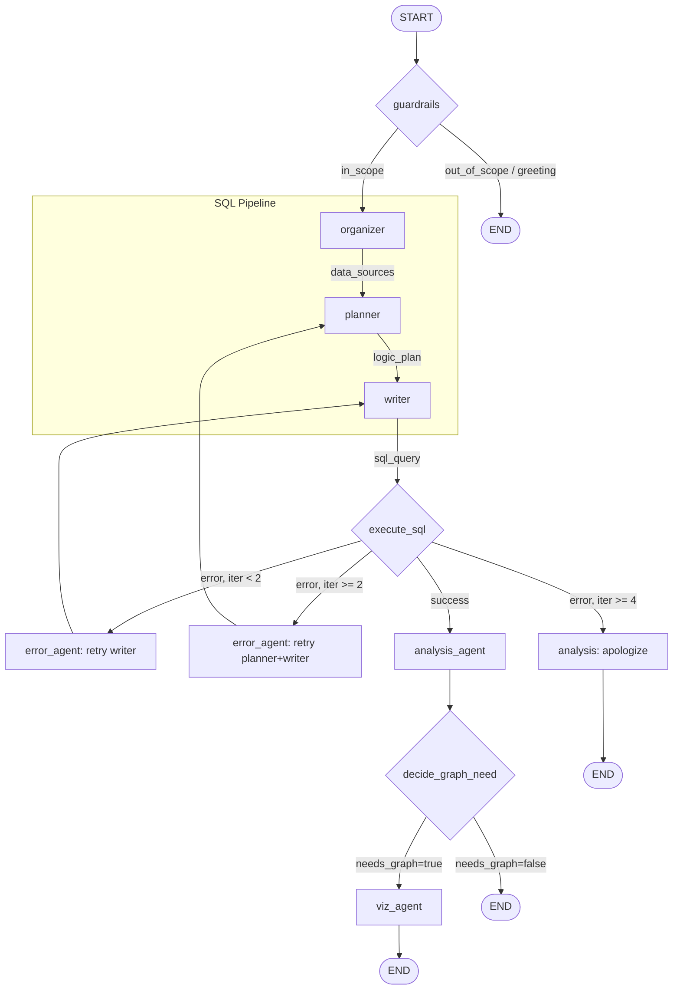

# Agent Module

Multi-agent Text-to-SQL system built with LangGraph.

## Architecture

The agent is a **9-node LangGraph pipeline** that converts natural language questions into SQL queries, executes them safely, and optionally generates visualizations.

### Agent Flow



### Nodes

| # | Node | Purpose | Writes to State |
|---|------|---------|-----------------|
| 1 | **gatekeeper** | Safety / legality gating | `is_legal` |
| 2 | **organizer** | Identify tables, fields, joins | `data_sources` |
| 3 | **planner** | Plain English SQL plan | `logic_plan` |
| 4 | **clarifier** | Analyze output expectations | `clarification` |
| 5 | **writer** | Generate SQL | `sql_query` |
| 6 | **execute** | Run via `safe_query` | `execution`, `query_result`, `error` |
| 7 | **validator** | Validate results / request retries | `validation_passed` |
| 8 | **analysis** | Natural language answer | `final_answer` |
| 9 | **viz_agent** | Safe Plotly generation | `graph_json` |

### Error Recovery Strategy

```
Attempt 1-2:  Retry writer only (syntax fixes)
Attempt 3:   Escalate to planner → writer (logic fixes)
Attempt 4+:  Give up, apologize
```

## State Schema

```python
class AgentState(TypedDict, total=False):
    # Conversation
    messages: Annotated[List[BaseMessage], add_messages]
    
    # DB context (set once per conversation)
    conn: sqlite3.Connection
    schema: Dict[str, List[str]]
    schema_enrichment: dict
    
    # SQL pipeline outputs
    data_sources: DataSources
    logic_plan: str
    clarification: dict
    sql_query: str
    
    # Execution
    query_result: str
    execution: SQLExecution
    final_answer: str
    
    # Control flow
    error: str
    iteration: int
    is_legal: bool
    validation_passed: bool
    
    # Visualization
    needs_graph: bool
    graph_type: str       # bar, line, pie, scatter
    graph_json: str       # Plotly figure JSON
```

## Conversation Support

- **In-state messages**: Full conversation history via LangGraph's `add_messages` reducer
- **SQLite checkpointer**: Persistence across sessions using `thread_id`
- **Scope**: 1 conversation = 1 database (switching DB starts new conversation)

## Safety

### SQL Safety
All queries run through `safe_query()` which:
- Rejects non-SELECT statements (no INSERT, UPDATE, DELETE, etc.)
- Enforces execution timeout
- Returns structured `SQLExecution` result

### Visualization Safety
Generated Plotly code is validated via AST before execution:
- **Whitelist**: `plotly`, `pandas`, `json`, basic math
- **Reject**: imports, `open()`, `exec()`, `eval()`, `__` attributes

## Directory Structure

```
agent/
├── README.md           # This file
├── graph.py            # LangGraph StateGraph definition
├── state.py            # AgentState TypedDict
├── nodes/              # Individual agent nodes
│   ├── guardrails.py
│   ├── organizer.py
│   ├── planner.py
│   ├── writer.py
│   ├── execute.py
│   ├── error_agent.py
│   ├── analysis.py
│   ├── decide_graph.py
│   └── viz_agent.py
├── tools/
│   ├── db_tools.py     # connect_to_db, safe_query
│   └── safe_viz.py     # AST-validated Plotly execution
└── schemes.py          # SQLExecution dataclass
```

## Usage

```python
from agent.graph import create_agent_graph

graph = create_agent_graph()

# Interactive use
result = graph.invoke(
    {"messages": [HumanMessage(content="How many orders in 2017?")]},
    config={
        "configurable": {
            "thread_id": "user_123_chat_1",
            "db_file": "path/to/database.db"
        }
    }
)

print(result["final_answer"])
```
